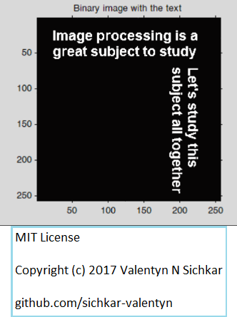
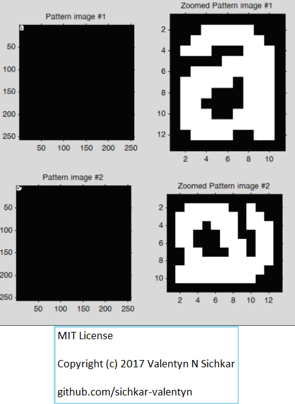
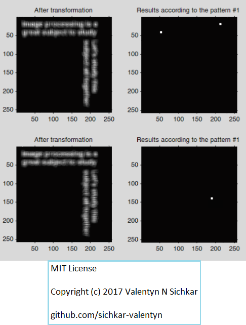

# Correlation function and Fourier Transform in Matlab
Using Correlation function and Fourier Transform to find one specific letter in the image with the text

### Reference to:
[1] Valentyn N Sichkar. Matlab - Correlation function and Fourier Transform to find one specific letter in the image with the text // GitHub platform [Electronic resource]. URL: https://github.com/sichkar-valentyn/Correlation_function_and_Fourier_Transform_in_Matlab (date of access: XX.XX.XXXX)

## Description
correlation function and Fourier Transform in Matlab to find one specific letter in the image with the text

## Conversion an original image to a binary one

## Constructing the images with the patterns

## Executing transformation for the images and finding the positioms of the letters

## MIT License
## Copyright (c) 2017 Valentyn N Sichkar
## github.com/sichkar-valentyn
### Reference to:
[1] Valentyn N Sichkar. Matlab - Correlation function and Fourier Transform to find one specific letter in the image with the text // GitHub platform [Electronic resource]. URL: https://github.com/sichkar-valentyn/Correlation_function_and_Fourier_Transform_in_Matlab (date of access: XX.XX.XXXX)
